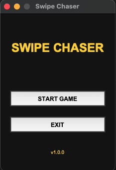
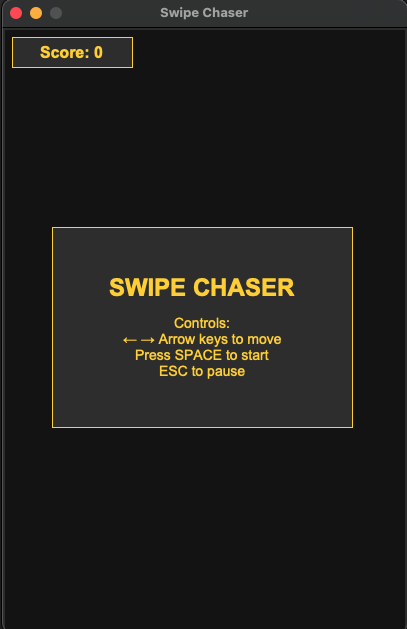
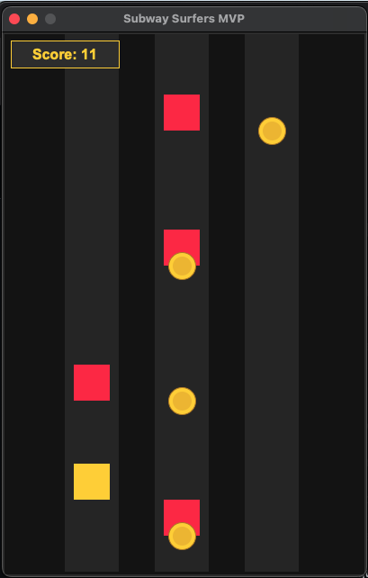
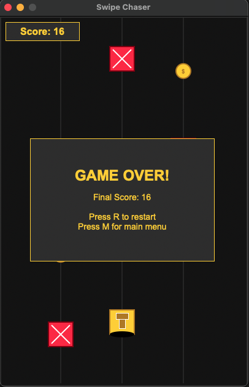

# Swipe Chaser 🕹️  
*A Subway Surfers-inspired endless runner built with Python*

Swipe Chaser is a minimalist 2D endless runner game developed in Python using the **Model-View-Presenter (MVP)** architecture. Inspired by Subway Surfers, the game challenges players to dodge obstacles and collect coins as the difficulty gradually increases.

Built with:
- 🐍 Python
- 🖼️ Tkinter (UI)
- 🔊 Pygame (sound, animation)
- 🧮 NumPy (procedural audio)

---

## 🎮 Gameplay Preview

<p align="center">
  
  
<!--  -->  
  
</p>

---

## 🚀 Features

- MVP architecture for clean separation of logic and rendering
- Real-time keyboard input handling (arrow keys + spacebar)
- Obstacle spawning, collision detection, and scoring system
- Procedural audio effects using NumPy
- Game states: Menu, Running, Paused, Game Over
- Polished UI with score feedback and restart options

---

## ▶️ How to Run

1. Install dependencies:
   ```bash
   pip install -r requirements.txt
2. Run the game:
   python3 main.py

Controls:
← → Arrow keys to move
SPACE to start
ESC to pause

Avoid red blocks and collect coins to increase your score!

Swipe-Chaser/
├── assets/              # Sprites, sounds, and other media
├── screenshots/         # Images for README
├── src/                 # Game code
│   ├── main.py
│   ├── models/
│   ├── views/
│   └── presenters/
├── requirements.txt
└── README.md

Made with ❤️ by @rohansaha27
