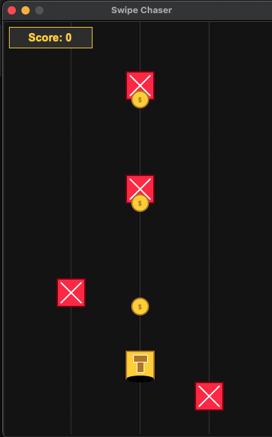

# Swipe Chaser 🕹️  
*A Subway Surfers-inspired endless runner built with Python*

Swipe Chaser is a minimalist 2D endless runner game developed in Python using the **Model-View-Presenter (MVP)** architecture. Inspired by Subway Surfers, the game challenges players to dodge obstacles and collect coins as the difficulty dynamically adapts to your skill level.

Built with:
- 🐍 Python
- 🖼️ Tkinter (UI)
- 🔊 Pygame (sound, animation)
- 🧮 NumPy (procedural audio)
- 🤖 scikit-learn (Machine Learning for Dynamic Difficulty)

---

## 🎮 Gameplay Preview

<p align="center">
  
  
  
  
</p>

---

## 🚀 Features

- MVP architecture for clean separation of logic and rendering
- Real-time keyboard input handling (arrow keys + spacebar)
- Obstacle spawning, collision detection, and scoring system
- Procedural audio effects using NumPy
- Game states: Menu, Running, Paused, Game Over
<<<<<<< HEAD
- Polished UI with score feedback and restart options
- **Dynamic Difficulty Adjustment with Machine Learning**
  - Adapts to player skill level in real-time
  - Tracks metrics like reaction time, near-misses, and coin collection
  - Adjusts game speed, obstacle patterns, and coin values
  - Provides personalized challenge for every player
=======
>>>>>>> a5ca3808b644e666632b1af844693b57cf65e5b9

---

## ▶️ How to Run

1. Install dependencies:
   ```bash
   pip install -r requirements.txt
2. Run the game:
   ```bash
   python3 main.py

Controls:
← → Arrow keys to move
SPACE to start
ESC to pause

Avoid red blocks and collect coins to increase your score!
  ```bash
Swipe-Chaser/
├── assets/              # Sprites, sounds, and other media
├── screenshots/         # Images for README
├── src/                 # Game code
│   ├── main.py
│   ├── models/
│   ├── views/
│   └── presenters/
├── requirements.txt
└── README.md
